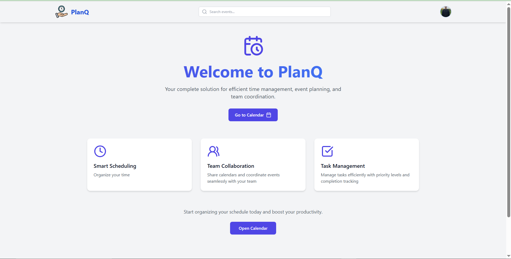
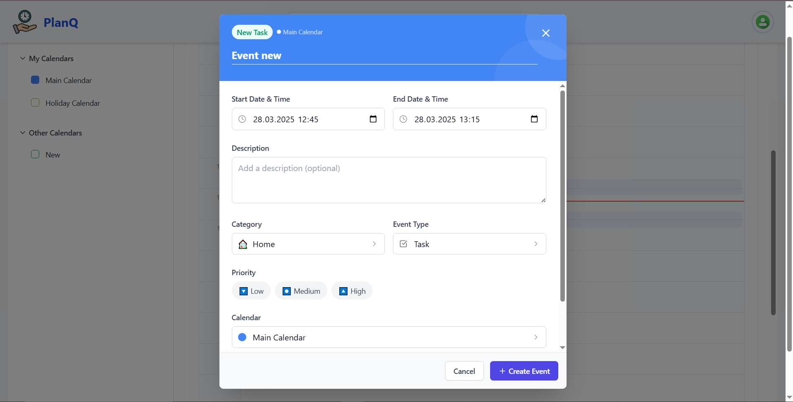
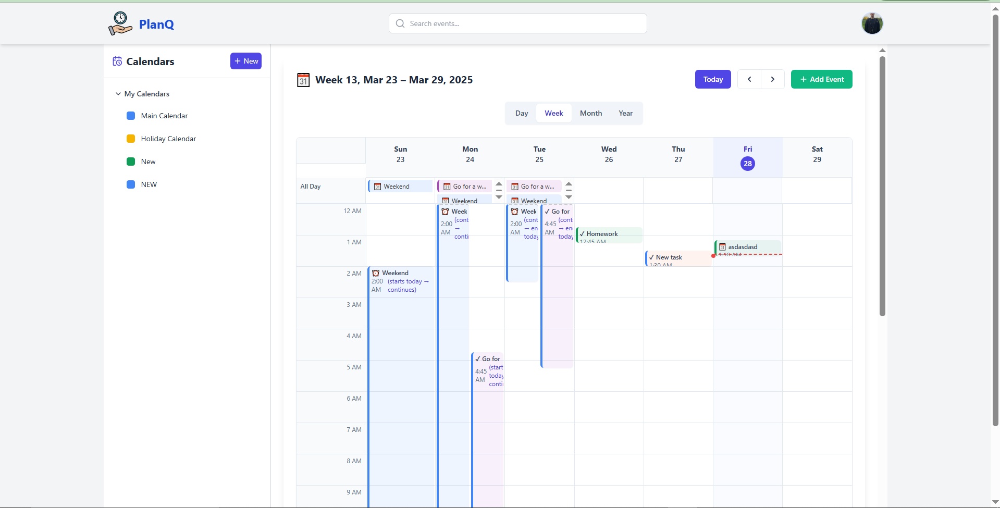
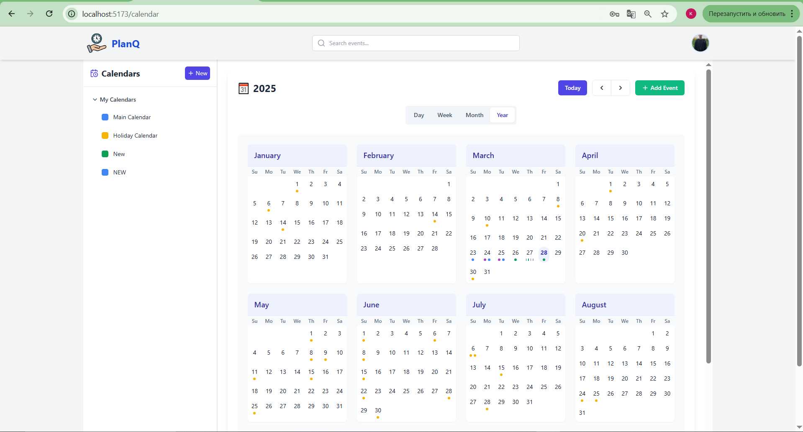
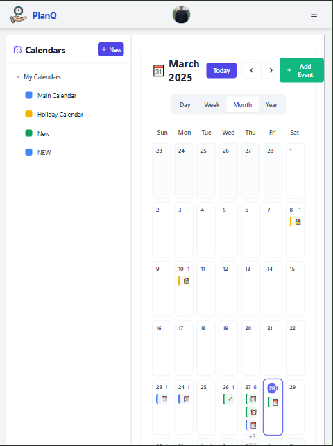

# Chronos Frontend

**Chronos** is a modern, intuitive time management application designed to help users efficiently organize their schedules, meetings, and tasks. The frontend provides a responsive, user-friendly interface that works seamlessly with the Chronos backend API.

## Table of Contents
- [Overview](#overview)
- [Features](#features)
- [Requirements and Dependencies](#requirements-and-dependencies)
- [Setup Instructions](#setup-instructions)
- [User Interface](#user-interface)
- [State Management](#state-management)
- [Calendar Views](#calendar-views)
- [Event Management](#event-management)
- [Responsive Design](#responsive-design)
- [Screenshots](#screenshots)

## Overview
The **Chronos Frontend** offers an elegant and intuitive interface for time management. It provides multiple calendar views, simple event creation, task tracking, and collaboration features. The application is designed with a focus on user experience, ensuring that all time management functions are easily accessible and visually appealing.

## Features
- **Intuitive Calendar Interface**: Day, Week, month, and year views
- **Easy Event Creation**: Create events directly from calendar or dedicated form
- **Multiple Event Types**: Support for arrangements, reminders, and tasks
- **Calendar Customization**: Personal calendars with custom colors and settings
- **Collaboration Tools**: Calendar sharing and event invitations
- **Search Functionality**: Quick search for events and tasks
- **Responsive Design**: Works on mobile, tablet, and desktop devices
- **National Holiday Integration**: Automatic display of holidays based on region

## Requirements and Dependencies
- **Modern Browser**: Chrome, Firefox, Safari, or Edge
- **NPM** (v10+ recommended)
- **Chronos Backend API** running and accessible

## Setup Instructions

Ensure the Chronos Backend is set up and running before starting the frontend.

1. **Clone the Repository**:
   ```bash
   git clone [repository-url]
   cd ucode-connect-Connect-FullStack-chronos-PlanQ-frontend
   ```

2. **Install Dependencies**:
   ```bash
   npm install
   ```


3. **Start the Development Server**:
   ```bash
   npm run dev
   ```

## User Interface
The application features a clean, modern interface with:
- **Navigation Sidebar**: Quick access to different calendars and views
- **Calendar Grid**: Interactive display of events and tasks
- **Event Cards**: Visually distinct cards for different event types
- **Form Components**: Intuitive forms for creating and editing events
- **Search Bar**: Easily find events across all calendars

## State Management
The frontend uses React with a centralized state management approach:
- **User Authentication State**: Login status and user information
- **Calendar Data**: Current view, selected dates, and filter settings
- **Event Information**: Event details and editing states
- **UI State**: Modal states, loading indicators, and notifications

## Calendar Views
Multiple calendar representations are available:
- **Day View**: Traditional day display 
- **Month View**: Traditional calendar grid with event indicators
- **Week View**: Detailed hourly breakdown with event blocks
- **Year View**: Annual overview with highlighted busy days
- **Custom Views**: Toggle between different categories or calendars

## Event Management
Users can manage events through:
- **Click Creation**: Direct calendar click to create events
- **Detailed Forms**: Full-featured event creation with all options
- **Drag and Drop**: Reschedule events through intuitive interactions
- **Bulk Actions**: Manage multiple events simultaneously

## Responsive Design
The application is designed to work across devices:
- **Mobile Layout**: Optimized for small screens with touch interactions
- **Tablet View**: Balanced layout for medium-sized screens
- **Desktop Experience**: Full-featured interface for larger displays
- **Print Layouts**: Printer-friendly calendar representations

## Screenshots

### Main page


### Event Creation


### Weekly Calendar View


### Year Calendar View


### Mobile Interface

